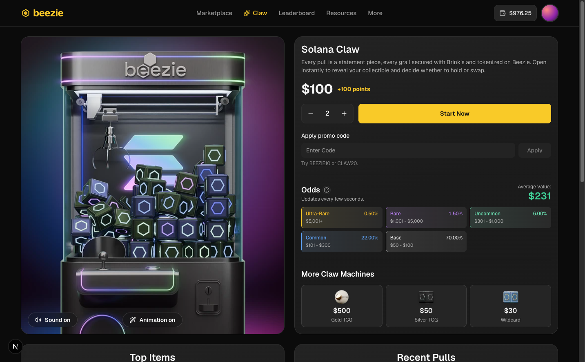

# Beezie Claw — pull & reveal



**[Live demo →](https://collectible-claw.vercel.app/)**

A standalone rebuild of the [Beezie](https://beezie.com) digital claw machine flow: pick a machine, choose a quantity, pay, watch the reveal, then keep the graded collectible or swap it back instantly for a percentage of its market value.

Everything behind the glass is mocked — wallet, inventory, RNG, payments. What is real is the front end: server rendering, a reveal video that never stalls, a state machine you can test without a browser, and the motion and haptics that make the pull feel like something.

## Running it

```bash
npm install
npm run dev        # http://localhost:3000
```

| Script                       | What it does                                                 |
| ---------------------------- | ------------------------------------------------------------ |
| `npm run dev`                | Next dev server (Turbopack)                                  |
| `npm run build && npm start` | Production build + server                                    |
| `npm test`                   | Vitest unit + component tests                                |
| `npm run test:e2e`           | Playwright, desktop + mobile projects                        |
| `npm run typecheck`          | `next typegen` + strict `tsc --noEmit`                       |
| `npm run lint`               | ESLint 9 with `eslint-config-next` (React Compiler rules on) |
| `npm run check`              | typecheck → lint → test                                      |

Node ≥ 20.9. Promo codes to try: `BEEZIE10`, `CLAW20`, `WELCOME5`. The demo wallet starts at $2,500 and lives in a cookie, so clearing cookies resets it.

### Testing on a real phone

```bash
npm run dev:lan          # binds 0.0.0.0, then open http://<your-lan-ip>:3000
```

Next 16 refuses dev-server requests from any origin other than the allow-listed ones, and the failure mode is quiet: the phone gets the server-rendered HTML, **never hydrates**, and nothing is tappable. `next.config.ts` therefore allow-lists this machine's LAN addresses (`allowedDevOrigins`), plus `127.0.0.1`, which is a different origin from `localhost` and is what Playwright points at. Restart the dev server after changing networks.

## What's in the box

| Surface                                                                   | Where                                  |
| ------------------------------------------------------------------------- | -------------------------------------- |
| Claw page (desktop + mobile), four routable machines                      | `/`, `/claw/[slug]`                    |
| Payment modal (centred dialog / bottom sheet)                             | `components/flow/PaymentModal.tsx`     |
| "Do not refresh" preparing state with "What you can pull" carousel        | `components/flow/PreparingModal.tsx`   |
| Fullscreen reveal video                                                   | `components/flow/RevealVideoLayer.tsx` |
| Single-item reveal                                                        | `components/flow/RevealSingle.tsx`     |
| Multi-item reveal: grid, multi-select, running total, 15-minute countdown | `components/flow/RevealMulti.tsx`      |
| Swap success                                                              | `components/flow/SwapSuccess.tsx`      |
| Odds table + explainer dialog, Top Items lightbox, Recent Pulls           | `components/claw/*`                    |

## Architecture

```
app/
  page.tsx, claw/[slug]/page.tsx   Server Components (dynamic SSR, streamed)
  actions.ts                       Server Actions: pullFromMachine · swapItems · applyPromo (zod-validated)
  error.tsx, global-error.tsx      Recoverable fallbacks (`retry()`); not-found.tsx for unknown slugs
components/
  claw/                            Page sections – server components + small client islands
  flow/                            The pull flow (client) – overlay, modals, reveal screens, video layer
  ui/                              Button, Stepper, Segmented, RadioCard, Money (NumberFlow), Skeleton…
lib/
  domain/                          Pure, isomorphic logic: odds, draw, pricing, format, cookie codecs
  data/                            Mock catalog, machines, promos + server-only repository & card-art resolver
  video/preloader.ts               Blob preloader for the reveal clip (framework-agnostic external store)
  effects/confetti.ts              Side-cannon confetti for the reveal (canvas-confetti, loaded on demand)
  haptics/events.ts                Semantic haptic events
  utils/scroll-lock.ts             Refcounted scroll lock that does not move the page
store/
  claw-flow.ts                     Pure reducer `transition(state, event)` + zustand store
  prefs.ts                         Sound / animation preferences (cookie-backed)
hooks/                             useRevealVideo, useAnimatedDialog, useHaptics, useCountdown, useMediaQuery
```

### Server vs client

"Use as much SSR as possible" was read literally: the whole page renders on the server, and the client bundle contains only genuine interactivity.

| Server-rendered (no client JS)                                                                                                                    | Client islands                                                                                                                                                     |
| ------------------------------------------------------------------------------------------------------------------------------------------------- | ------------------------------------------------------------------------------------------------------------------------------------------------------------------ |
| Header, footer, machine hero frame, machine details, price, odds table, tier chips, sibling machine links, Top Items grid data, Recent Pulls feed | Wallet chip (animated number), idle-video stage + Sound/Animation toggles, quantity stepper + CTA, promo input, odds explainer, Top Items lightbox, the pull flow |

- **Mock data lives on the server** (`lib/data/*`, imported with `server-only`) behind async repository functions with small artificial latencies. Top Items and Recent Pulls are wrapped in `<Suspense>` so they **stream** after the above-the-fold HTML; the skeletons are visible on a cold load.
- **The route is dynamic on purpose.** `MachinePage` reads two cookies (`cc_prefs`, `cc_wallet`), so the first HTML already carries the visitor's sound/animation preference and wallet balance — no hydration flash, no client fetch. `generateStaticParams` + `dynamicParams = false` act as the slug allow-list (`/claw/anything-else` → 404). Drop the two cookie reads and the route prerenders at build time with identical markup.
- **Mutations are Server Actions.** The pull is decided on the server with a CSPRNG over the published odds; the swap credit is recomputed server-side from a signed, HttpOnly swap-offer cookie (`lib/domain/swap-ticket.ts`) and never trusted from the client. Because the actions write the wallet cookie, Next re-renders the route in the same round trip — the server-rendered header balance and Recent Pulls update with no client wiring at all.
- `cacheComponents` (PPR) is intentionally off: it changes the caching model and would demand Suspense around every request-time read on a page that is already fully dynamic.

### The pull flow as a state machine

`store/claw-flow.ts` is a pure reducer, tested without React:

```
idle → payment → preparing → opening → reveal → swapping → swapped
```

`preparing → opening` happens only once **three** independent gates are in, in any order: the Server Action returned the pull, the reveal clip is fully buffered, and the minimum six-second "Do not refresh" dwell has elapsed. Ignored events return the same state reference, so subscribers bail out cheaply.

### Reveal video preloading

`lib/video/preloader.ts` downloads the clip as a **Blob with byte-level progress** as soon as the page hydrates, hands the object URL to a single persistent `<video>` (mounted from hydration onwards, hidden until needed), and reports `ready` only once the element fires `canplaythrough`. At reveal time, playback comes from memory.

- Portrait screens get the square clip, everything else the 16:9 one — chosen once per page load and never swapped after the element is activated.
- **iOS:** pressing _Confirm_ is the user gesture. Inside that click the element is played and immediately paused (`unlock`), which activates it so the later programmatic `play()` — with sound, if the user opted in — is allowed.
- Failure modes are covered: fetch failure → fall back to streaming the file with `preload="auto"`; `canplaythrough` never firing → accept `readyState ≥ 3` after 8 s; a stalled clip → a watchdog advances to the reveal after its duration; hidden tab → resume on return.

**Verify it:** load the page, then in DevTools run `document.getElementById('reveal-video')` — `readyState === 4` and `src` starts with `blob:` before you ever press Start Now. The Network panel shows one `reveal-*.mp4` request on load and none during the reveal.

### Overlays: locking, and dismissals that finish

Two things go wrong with modals often enough to be worth solving once, in one place.

**The page must not move when an overlay opens.** Hiding the page scrollbar widens the viewport, and every centred layout underneath jumps a few pixels. `scrollbar-gutter: stable` fixes this where it is supported, but silently does nothing where it is not, so `lib/utils/scroll-lock.ts` measures the actual damage: it reads the document width, applies the lock, reads it again, and gives back the difference as padding (plus `--scroll-lock-gap` for fixed bars, which page padding cannot reach). On an engine that honours the gutter the measured difference is zero and nothing is applied. The lock is refcounted, so a lightbox opened over the flow does not unlock the page when it alone closes.

**A dismissal has to be allowed to finish.** `dialog.close()` yanks the element out of the top layer immediately, which cuts any exit animation short — the classic "fades in nicely, vanishes instantly" asymmetry. `hooks/use-animated-dialog.ts` keeps the element open until AnimatePresence reports the exit is done, intercepts Escape for the same reason, and carries a timer fallback because a hidden tab pauses rAF and would otherwise strand the dialog open. The flow overlay dismisses in layers rather than as one cross-fade: the panel drops and fades, the backdrop and its blur release alongside it, and the overlay unmounts when the backdrop's animation completes.

**Verify it:** with the browser set to always-visible scrollbars, open the odds explainer and watch the page behind it — headings and the header keep their exact position, and `document.documentElement.style.paddingRight` shows the compensation (or stays empty where the gutter already holds).

### Motion and micro-interactions

- The primary CTAs (Start Now, Confirm) carry a charged hover state: a conic-gradient light travelling counter-clockwise around the border behind a ring mask, embers rising from the base, a cursor-tracking bloom, and a ring burst from the exact press point. All of it is composited transform and opacity work, mounted only while the pointer is on the button.
- Chips that sit over video (Sound on the reveal, Sound/Animation on the idle stage) are real frosted glass. Note that hand-writing both `backdrop-filter` and `-webkit-backdrop-filter` makes Lightning CSS drop the standard property; write the unprefixed one and let it add the prefix.
- Any element using `mix-blend-mode` inside an overlay needs `isolation: isolate`, otherwise it joins the overlay's blend group and the overlay's `backdrop-filter` composites twice — the blur visibly deepens on hover.
- `MotionConfig reducedMotion="user"` is set globally, and the CTA's embers and burst are skipped explicitly under a reduced-motion preference.

### Haptics

`web-haptics` is used through a small semantic layer (`lib/haptics/events.ts`) for direct interface feedback: `tap`, `select`, `tick`, `confirm`, `error`, `success`. Reveal-video playback deliberately schedules none.

| Platform         | Mechanism                                                         |
| ---------------- | ----------------------------------------------------------------- |
| Android Chrome   | `navigator.vibrate`, intensity emulated by PWM                    |
| iOS Safari 17.4+ | the `<input type="checkbox" switch>` trick (system switch haptic) |
| Desktop          | no-op; append `?haptics=debug` to hear an audible click per pulse |

### The celebration, and its limits

The reveal is celebrated: as the opening video hands over to the reveal screen, three volleys of confetti fire in from just off both edges (`lib/effects/confetti.ts`), so the streams cross in front of the card rather than raining onto it. `canvas-confetti` is imported on demand, so it stays out of the initial bundle; the burst is cancelled if the reveal is dismissed mid-volley, fires once per pull (a failed swap returns to `reveal` and must not re-trigger it), and is skipped entirely under `prefers-reduced-motion`.

What it deliberately does **not** do is scale with the outcome. Every pull gets the same volley in the same brand colours, and rarity colour stays where it is information — the published odds table and the market values in the feeds. The interface should celebrate that you opened something, not grade how well the gamble paid.

## Responsive notes

- Desktop: hero and details side by side; Top Items and Recent Pulls share the viewport below, both fixed-height and internally scrollable so the row never grows.
- Mobile: stacked layout, collapsible promo field, a fixed bottom bar with the stepper + CTA (safe-area aware), the payment modal becomes a drag-to-dismiss bottom sheet, the reveal grid drops to two columns, and the square reveal clip is used.
- Overlays use `100dvh`, `viewport-fit=cover` and `env(safe-area-inset-*)`; the page behind the flow is `inert` and scroll-locked.
- Audio is muted by default; the Sound toggle is shared between the idle loop and the reveal, and persisted in a cookie.

## Testing

Vitest + jsdom + Testing Library for everything that can run without a browser; Playwright for what cannot. Per Next's own guidance, async Server Components are not unit-testable, so the split is:

- **Pure logic** — odds normalisation and invariants, weighted draw (seeded, 20 000-sample distribution check), pricing/promo/swap maths, formatting, cookie codecs, the video preloader (mocked chunked fetch, fallback, timeout), the flow reducer (every guard, all gate orders), the scroll lock (refcounting, idempotent release, measured compensation), and the confetti volleys (aim, scheduling, cancellation — the library is injected).
- **Server Actions** — with `next/headers` mocked: validation, insufficient funds, wallet debit/credit, swap of foreign/duplicate/expired items.
- **Components** — Stepper, PaymentModal, RevealMulti (selection, totals, countdown with fake timers), the odds explainer dialog.

```bash
npm test
```

jsdom implements neither media playback nor `<dialog>`, so `vitest.setup.ts` stubs `play`/`pause`/`load`, `showModal`/`close`, `matchMedia`, object URLs and `navigator.vibrate`.

### End-to-end

Playwright runs the specs against Chromium and a Pixel 7 profile, reusing a local dev server: odds visibility, the explainer dialog opening and closing, the payment review and its dismissal, and the transition into the preparing state. The CTA ships in the server-rendered HTML and is clickable before the flow island hydrates, so `openPayment()` retries the click until the dialog actually opens rather than assuming the first one landed.

```bash
npx playwright install chromium   # once per machine
npm run test:e2e
```

## Adding card artwork

Catalog ids are stable. Drop a photo at `public/cards/<catalog-id>.jpg` (or `.webp`/`.png`) and it is picked up on the next request — the server resolves artwork with a filesystem check, and items without a photo render a styled slab placeholder.

## Trade-offs and what's mocked

- The recent-pulls feed lives in server memory and resets on restart; the wallet is a cookie the user could edit. The swap offer is a signed cookie rather than server memory, so it survives the serverless instance hop between the pull and the swap (set `CLAW_SWAP_SECRET` per environment; there is a demo fallback). All of this is documented mock behaviour — the shapes (`ActionResult`, `PullResult`, `SwapResult`) are what a real API would return.
- All four machines share the one idle clip and poster that were provided.
- The "Credit / Debit" tab is a placeholder for the Coinflow widget.
- Haptics are verifiable only on real hardware; iOS support rides on a documented Safari quirk and degrades to nothing everywhere else.
